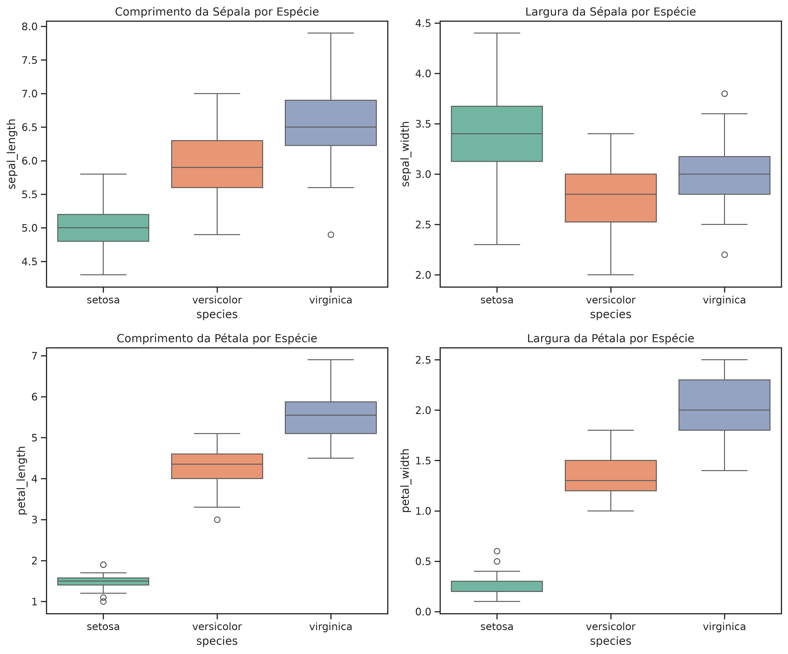
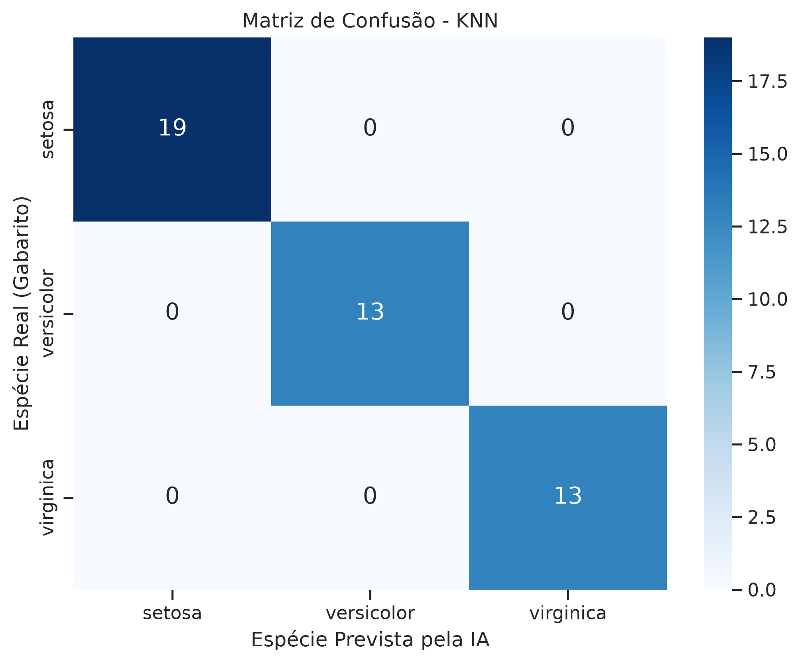

# Estudos em Machine Learning & Data Science

Este repositório reúne meus notebooks pessoais de anotações, códigos conceituais e projetos práticos criados durante meus estudos de Ciência de Dados e Aprendizado de Máquina. O objetivo é consolidar a base matemática e computacional para pesquisas de **Iniciação Científica (IC)** no **ICMC/USP**.

---

## Estrutura do Repositório

O projeto está organizado de forma modular, cobrindo desde a fundamentação em bibliotecas essenciais até estudos de caso com dados complexos de sensores:

* **`notas-pandas.ipynb`**: Manipulação de dados tabulares, estruturas fundamentais (`Series` e `DataFrame`), técnicas de filtragem, ordenação, gerenciamento de memória (View vs. Copy), tratamento de valores nulos, agrupamentos com `groupby` e junções com `merge`.
* **`notas-matplotlib.ipynb`**: Fundamentos de visualização de dados, mapeamento da hierarquia `Figures` e `Axes`, gráficos estatísticos (linhas, dispersão, barras, histogramas) e matrizes de correlação com mapas de calor.
* **`notas-analise-e-pre-processamento.ipynb`**: Limpeza de dados reais utilizando o dataset do Titanic. Inclui engenharia de recursos, tratamento avançado de dados ausentes com imputação por mediana filtrada e detecção de *outliers* através de boxplots.
* **`notas-scikit-learn.ipynb`**: Introdução prática aos paradigmas de Machine Learning (Supervisionado e Não Supervisionado), cobrindo regressão linear, classificação linear, mapeamento espacial com kernels e algoritmos de agrupamento (*Clustering*) como o DBSCAN.
* * **`gps-spoofing.ipynb`**: Aplicação inicial de Machine Learning para classificação de espécies de flores Iris (pipeline clássico de dados/ML).
* **`gps-spoofing.ipynb`**: Aplicação avançada de Machine Learning para segurança em sistemas aéreos não tripulados (UAS/Drones) via processamento de sinais GNSS.

---

## Projetos & Estudos de Caso

### 1. Detecção de Spoofing GNSS em UAS (Projeto de Aplicação)

Estudo focado na identificação de ataques de falsificação de sinal GNSS (*spoofing*) em drones a partir de dados temporais multicanais de receptores a bordo.

* **Engenharia de Features de Domínio Físico:** Construção da métrica $\vert{}Doppler - TCD\vert{}$ para mensurar incoerências físicas entre a fase da portadora e o deslocamento Doppler nos 8 canais de satélite visíveis.
* **Validação Cruzada Consciente de Séries Temporais:** Substituição do *shuffle* aleatório por validação baseada em blocos de janelas contínuas para evitar o vazamento de dados (*data leakage*) decorrente da autocorrelação temporal.
* **Pós-Processamento Temporal:** Aplicação de redução do limiar de decisão de probabilidade (ajustado para 18%) combinada a um filtro de votação majoritária (*majority voting*), elevando a taxa de detecção (*Recall*) do ataque de **52% para 84%**.

---

### 2. Pipeline Clássico de Classificação (Dataset Iris)

Demonstração de um pipeline padronizado e reprodutível de Aprendizado de Máquina para tarefas de classificação supervisionada:

1. **Análise Exploratória (EDA):** Mapeamento de distribuições e validação visual da separabilidade das classes com Seaborn e Matplotlib.
2. **Seleção de Algoritmo:** Validação Cruzada (*5-Fold Cross-Validation*) comparando **SVC**, **Random Forest** e **KNN**.
3. **Diagnóstico Final:** Divisão determinística (`random_state=42`), avaliação via relatório de classificação e análise de matriz de confusão.

#### Resultados Visuais (Dataset Iris)

##### Distribuição e Correlação das Espécies (Pairplot)

##### Avaliação do Modelo Campeão (Matriz de Confusão - KNN)

---

## Tecnologias Utilizadas

* **Linguagem:** Python 3
* **Análise e Manipulação:** Pandas, NumPy
* **Visualização:** Matplotlib, Seaborn
* **Machine Learning:** Scikit-Learn

---

## Autor

Desenvolvido por **Luís Henrique Varela Medeiros Bezerra** 
* Aluno de Bacharelado em Ciência de Computação (BCC) — **ICMC/USP**
* [GitHub Profile](https://github.com/luishvarela)
